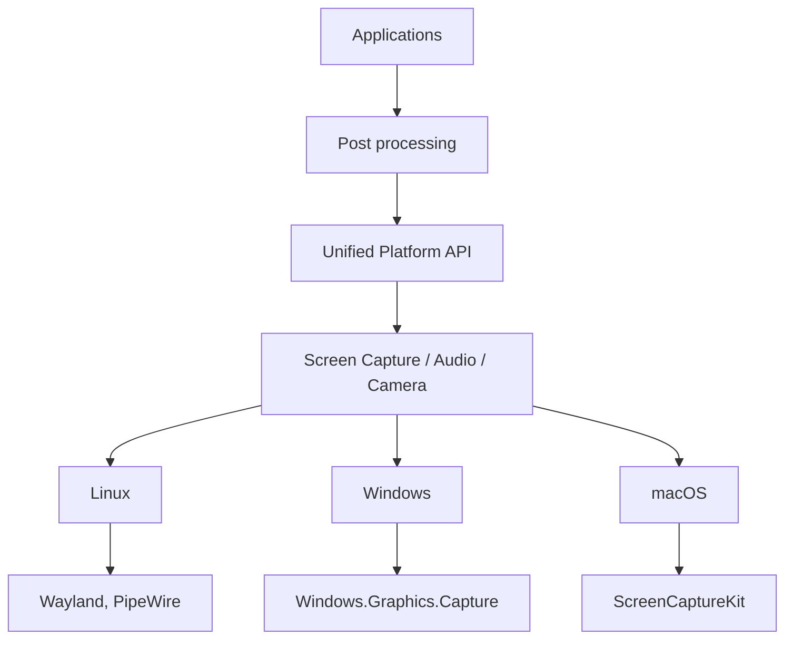
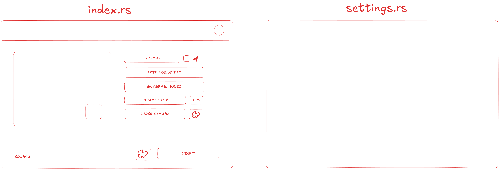

# nocaprs [WIP]

Cross platform screen recording tool with built in support for camera and
microphone input, along with features like mouse tracking and live zoom,
all built from the ground up in Rust.


## Directory structure
```
.
├── app                  # Contains user applications
│   ├── nocaprs          # Main gui user application
│   └── nocaprs-cli      # Future planned nocaprs cli application
└── crates               # Internal crates for nocaprs application
    ├── platform         # Platform interfaces without any implementation
    └── platform-*       # Platform interfaces implementations for a specific platform
```

## Architecture


## UI

This is a very early prototype design idea for the main application


